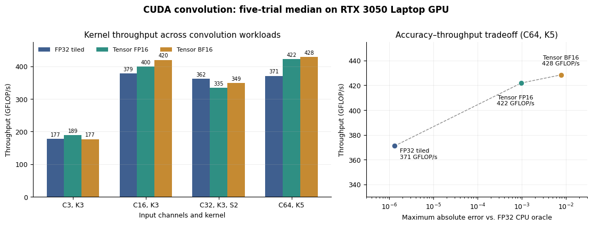

# CUDA Convolution Optimization Lab

A shape-general implementation of valid 2D convolution in NCHW layout, built
to make GPU optimization decisions measurable rather than anecdotal. The
project compares a scalar CPU oracle with direct and implicit-GEMM FP32 CUDA
kernels, FP16 and BF16 Tensor Core paths with FP32 accumulation, and a
transparent layer-adaptive dispatcher. On an RTX 3050 Laptop GPU, five-trial
median results reached 428.4 GFLOP/s, up to 1.89x the direct CUDA kernel and
over 350x the optimized single-thread CPU oracle. Speedups use kernel-only timing;
conversion, allocation, and transfer costs are reported separately.

## What this demonstrates

- Correct indexing for arbitrary batch sizes, rectangular inputs, non-tile-
  aligned outputs, and configurable stride.
- Constant-memory filter reuse when a direct-convolution filter bank fits in
  CUDA's 64 KiB constant-memory budget.
- A 16 x 16 shared-memory GEMM formulation that generates im2col coordinates
  on demand instead of materializing the expanded matrix.
- Four-warp Tensor Core kernels with genuine FP16 or BF16 tensor storage,
  shared weight reuse, tail-safe tiles, and FP32 accumulation.
- Layer-adaptive dispatch using an explicit, inspectable heuristic.
- CPU-oracle validation, CUDA-event kernel timing, separate end-to-end timing,
  deterministic inputs, and repeated-trial median reporting.

## Repository layout

~~~text
include/cuda_conv/conv2d.hpp  public shape, algorithm, and result API
src/cpu_reference.cpp        scalar correctness oracle and error metrics
src/cuda_conv.cu             FP32/Tensor Core kernels, dispatch, and timing
app/benchmark.cpp            reproducible benchmark CLI and CSV export
tests/correctness.cpp        shape and stride regression suite
scripts/plot_results.py      benchmark figure generated from the reference CSV
docs/optimization-notes.md   retained designs, negative results, methodology
results/                     committed reference measurements
~~~

## Requirements

- NVIDIA GPU with CUDA support
- CUDA Toolkit 12.x or a compatible recent toolkit
- C++17 host compiler
- CMake 3.24+ (recommended) or direct nvcc

The FP16 Tensor Core path requires compute capability 7.0 or newer; BF16
requires Ampere (8.0) or newer. FP32 kernels remain available on older GPUs.

## Build

### CMake

~~~bash
cmake -S . -B build -DCMAKE_BUILD_TYPE=Release
cmake --build build --config Release
ctest --test-dir build -C Release --output-on-failure
~~~

Override architecture detection when cross-compiling:

~~~bash
cmake -S . -B build -DCMAKE_CUDA_ARCHITECTURES=86
~~~

### Windows without CMake

Run from a Visual Studio Developer PowerShell:

~~~powershell
.\scripts\build_windows.ps1
.\build\cuda-conv-correctness.exe
~~~

Use `-BuildDirectory build-local` to select a different output directory.

## Benchmark

~~~bash
./build/cuda-conv-bench --quick
./build/cuda-conv-bench --iterations 100 --trials 5 --csv results/local.csv
./build/cuda-conv-bench --algorithm tensor-fp16
./build/cuda-conv-bench --algorithm tensor-bf16
./build/cuda-conv-bench --shape 8,3,32,32,16,3,1 --algorithm all
~~~

The shape order is N,C,H,W,M,K,S, and --shape can be repeated to construct a
custom sweep. Console output reports speedup over the direct CUDA kernel;
the CSV additionally retains the optimized scalar-CPU comparison.

The benchmark reports the median kernel time across repeated trials separately
from end-to-end latency. Every timed configuration is checked against the FP32
CPU reference before it is marked as passing.

## Why not cuDNN?

For production convolution, use cuDNN. It has architecture-specific kernels,
heuristic engine selection, autotuning, broader datatype support, and years of
optimization that this study does not attempt to replace.

The purpose here is to expose the mechanisms hidden behind a library call:
tensor indexing, memory reuse, tiling, implicit lowering, synchronization,
shape-dependent dispatch, numerical validation, and disciplined timing. A
custom kernel becomes operationally justified when it enables fusion,
specialized layouts or sparsity, unusual small-shape behavior, or another
workload constraint that a general library cannot express efficiently. No
such superiority claim is made for this generic convolution.

## Reference results

The left panel shows where Tensor Core execution helps across workloads; the
right panel makes the precision tradeoff explicit on the largest tested layer.
All plotted values come from the committed reference CSV.

Measured on an NVIDIA GeForce RTX 3050 Laptop GPU (compute capability 8.6),
CUDA 12.8, and driver 596.08. The CPU comparison is an optimized,
single-threaded scalar oracle compiled with MSVC /O2. Values are medians of
five trials with 100 timed kernel launches per trial.

| Shape | Kernel | Kernel time | Throughput | Direct speedup | Max abs. error |
|---|---:|---:|---:|---:|---:|
| N1 C1 8x8, M4 K3 S1 | direct FP32 | 0.0157 ms | 0.2 GFLOP/s | 1.00x | 1.49e-8 |
| N8 C3 32x32, M16 K3 S1 | tensor FP16 | 0.0329 ms | 189.3 GFLOP/s | 1.23x | 1.47e-4 |
| N4 C16 32x32, M32 K3 S1 | tiled FP32 | 0.1319 ms | 251.5 GFLOP/s | 1.13x | 2.98e-7 |
| N4 C16 32x32, M32 K3 S1 | tensor FP16 | 0.0829 ms | 400.0 GFLOP/s | 1.80x | 2.93e-4 |
| N4 C16 32x32, M32 K3 S1 | tensor BF16 | 0.0790 ms | 419.9 GFLOP/s | 1.89x | 2.46e-3 |
| N2 C64 28x28, M64 K5 S1 | tiled FP32 | 0.6340 ms | 372.1 GFLOP/s | 1.23x | 1.31e-6 |
| N2 C64 28x28, M64 K5 S1 | tensor FP16 | 0.5593 ms | 421.9 GFLOP/s | 1.39x | 9.69e-4 |
| N2 C64 28x28, M64 K5 S1 | tensor BF16 | 0.5507 ms | 428.4 GFLOP/s | 1.41x | 7.65e-3 |

The tiny workload is intentionally retained: kernel-launch overhead makes the
GPU kernels slower than the CPU oracle, and their differences are within ordinary
run-to-run noise. This prevents the larger-layer speedups from being presented
as universal. Raw measurements, including end-to-end latency and all five
execution modes, are in
[results/reference-rtx3050.csv](results/reference-rtx3050.csv).

Regenerate the figure with Python, Matplotlib, and NumPy:

~~~bash
python scripts/plot_results.py
~~~

## Scope

This is an educational kernel study, not a replacement for cuDNN. It currently
implements unpadded, undilated FP32, FP16, and BF16 cross-correlation with
square kernels. Tensor Core outputs accumulate in FP32.
Performance claims are limited to the committed shapes, hardware, and raw
results. See [the optimization notes](docs/optimization-notes.md) for the
rationale and the experiments that did not survive validation.

Nsight Compute source-level profiling is supported by the build, but hardware
performance counters were unavailable on the reference Windows configuration.
No peak-occupancy or peak-bandwidth claim is made without those counters.

## Authorship and license

Designed and implemented by **Nippun Sabharwal**. Released under the MIT
License.
